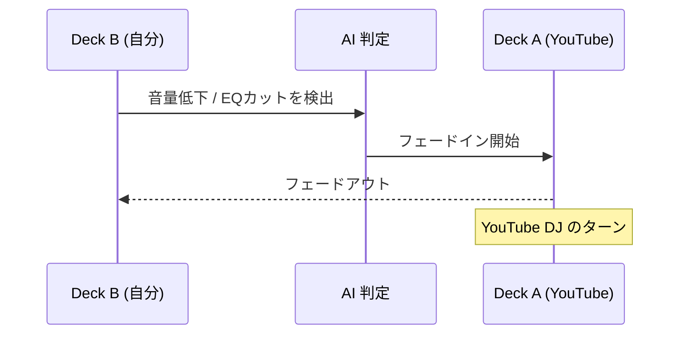
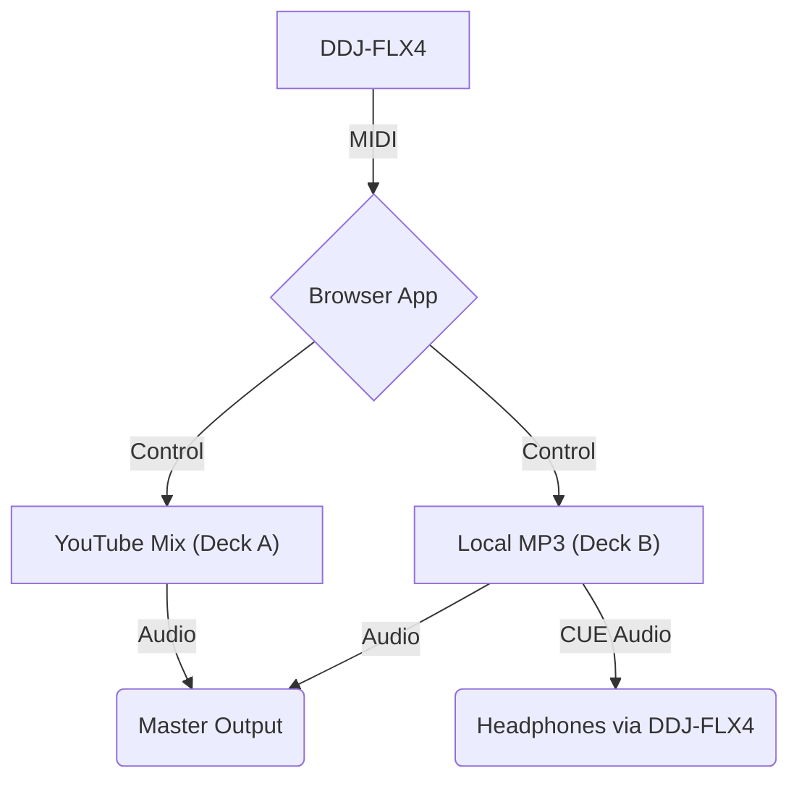

# TubeMix B2B サービス仕様書

**バージョン**: 1.0 (Draft)  
**最終更新**: 2026-01-22  
**ステータス**: 構想段階（壁打ち完了）

---

## 1. サービス概要

### 1.1 コンセプト
YouTube の DJ Mix 動画を「対戦相手」に見立て、手元の DJ コントローラー（DDJ-FLX4）を使用してブラウザ上で B2B セッションを行う DJ 練習ツール。

### 1.2 ターゲットユーザー
- DJ コントローラーを所有している DJ 練習者
- 耳でピッチを合わせるスキルを向上させたい人
- Boiler Room などのトップ DJ の Mix と一緒に練習したい人

### 1.3 コアバリュー
> **「機材さえあれば、世界中の DJ Mix が君の練習台になる」**

- 波形に頼らない、本質的な DJ スキル（耳と直感）を鍛える
- インストール不要、ブラウザだけで完結

---

## 2. 機能要件

### 2.1 Deck A (YouTube / マスター)
| 機能 | 説明 |
|------|------|
| YouTube 動画再生 | URL を入力して動画を再生 |
| 再生速度 | 1.0 倍速固定（YouTube API の制約） |
| 波形表示 | ビジュアライザーで代用（CORS 制限のため） |

### 2.2 Deck B (ローカル / ターゲット)
| 機能 | 説明 |
|------|------|
| 音源読み込み | MP3 等のローカルファイルをドラッグ＆ドロップ |
| ピッチ調整 | DDJ-FLX4 のピッチフェーダーで ±8% 調整 |
| BPM 表示 | 解析した BPM をリアルタイム表示 |
| 波形表示 | Web Audio API で生成した波形を Canvas 描画 |
| EQ (Hi/Mid/Low) | DDJ-FLX4 のノブで周波数帯域を調整 |

### 2.3 ミキサー機能
| 機能 | 説明 |
|------|------|
| クロスフェーダー | Deck A / B の音量バランスを調整 |
| CUE ボタン | Deck B をヘッドホンでモニター |

### 2.4 練習支援機能
| 機能 | 説明 |
|---------|------|
| Blind Mode | 波形を非表示にし、耳だけで合わせる練習モード |
| BPM タップ | YouTube 側の BPM を手動で推定 |

### 2.5 AI Auto Transition
自分の曲 (Deck B) から YouTube (Deck A) へのバトンタッチを AI が自動判定し、クロスフェードを実行する機能。

| 項目 | 説明 |
|------|------|
| **トリガー条件** | Deck B の音量低下 / EQ Low カット / 残り小節数 |
| **動作** | Deck A の音量を 4〜8 小節かけてフェードイン |
| **結果** | YouTube DJ のターンが自動で開始 |

---

## 3. 技術設計

### 3.1 技術スタック
| レイヤー | 技術 |
|----------|------|
| フロントエンド | Vite + React + TypeScript |
| 音声処理 | Web Audio API |
| MIDI 連携 | Web MIDI API |
| 動画再生 | YouTube IFrame API |
| デザイン | Glassmorphism, CSS Variables |

### 3.2 システム構成図

### 3.3 オーディオルーティング
PC の複数オーディオ出力を利用（案 B）：
- **出力1 (PC 内蔵スピーカー)**: Master 出力（Deck A + Deck B のミックス）
- **出力2 (DDJ-FLX4 ヘッドホン)**: CUE 出力（Deck B のモニター）

> ※ DDJ-FLX4 は 2ch オーディオインターフェースのため、ブラウザの Web Audio API で出力先を分離する。

### 3.4 MIDI マッピング (DDJ-FLX4)
| コントローラー | 機能 |
|----------------|------|
| JOG Wheel | スクラッチ / ピッチベンド |
| Pitch Fader | 再生速度 (playbackRate) |
| EQ Knobs | BiquadFilterNode で周波数調整 |
| CUE Button | ヘッドホンルーティング切替 |
| Play/Pause | 再生 / 停止 |
| Crossfader | Deck A/B 音量バランス |

---

## 4. UI 設計

### 4.1 レイアウト構成
- **ヘッダー**: ロゴ、MIDI 接続ステータス、Waveform トグル
- **上部**: YouTube プレイヤー (Deck A) - 大きく配置
- **中央**: Deck B 情報 (BPM, ピッチ偏差, 波形)
- **下部**: ミキサー (EQ, Filter, Crossfader)
- **背景**: アンビエントライティング演出

### 4.2 デザインコンセプト
- ダークモード基調
- Glassmorphism（ガラス効果）
- ネオンブルー / ピンクのアクセントカラー
- プロフェッショナル DJ ソフトウェア風

### 4.3 モックアップ
[tubemix-b2b-mockup.html](file:///Users/tsun/life/projects/tubemix-b2b-mockup.html)

---

## 5. 制約事項

### 5.1 YouTube API の制限
- 再生速度は 0.25 刻みのステップ調整のみ（細かいピッチ調整不可）
- 音声データへの直接アクセス不可（CORS）→ 波形生成はビジュアライザーで代用

### 5.2 ブラウザの制限
- Web MIDI API は Chrome / Edge でのみ安定動作
- マルチチャンネル出力は DDJ-FLX4 のオーディオインターフェース依存

---

## 6. 将来の拡張機能

### 6.1 Ghost Session
操作ログを記録し、後から「答え合わせ」ができる機能

### 6.2 Ambient Visualizer
YouTube 動画の色を抽出し、画面全体をその色で照らす没入演出

### 6.3 B2B Battle Mode
AI による繋ぎの採点、または波形の後出し公開による自己評価

---

## 7. サービス名候補
| 候補 | コンセプト |
|------|------------|
| **TubeMix B2B** | 直感的で分かりやすい |
| **F2F (Fade to Face)** | YouTube の DJ と対峙するニュアンス |
| **EarTrain DJ** | 練習ツールとしての側面を強調 |
